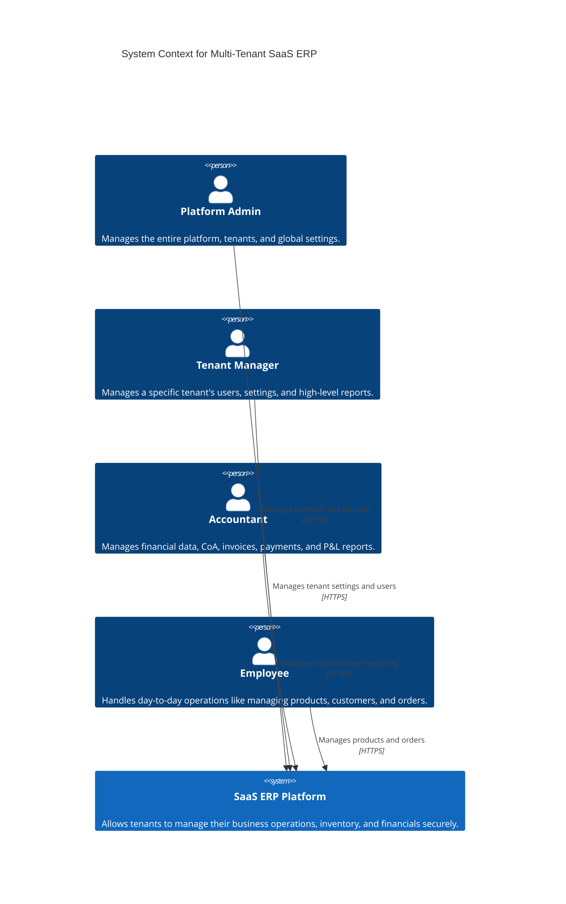
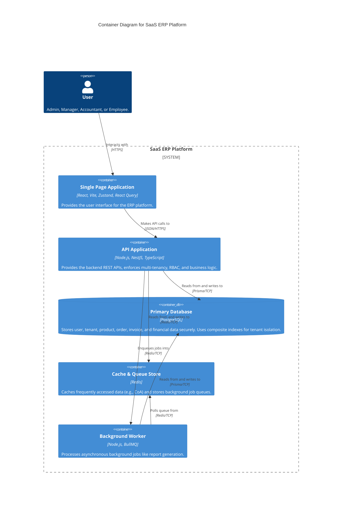
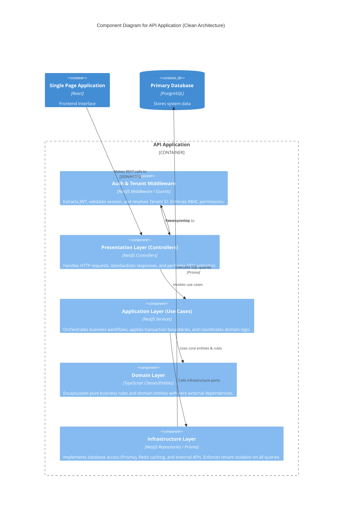

# SaaS ERP Architecture

## 1. System Context Diagram (Level 1)

This diagram illustrates the SaaS ERP system in its environment, showing the users who interact with it and the external systems it depends on.

## 2. Container Diagram (Level 2)

This diagram zooms into the SaaS ERP system to show the high-level technical containers that make up the system.

## 3. Component Diagram (Level 3 - Backend API)

This diagram zooms into the NestJS API Application to show the structural components modeled after Clean Architecture principles.

## 4. Data Flow Explanation

The SaaS ERP requires strict multi-tenancy and data isolation. Below is the data flow for a typical request (e.g., retrieving financial data):

1. **Client Request**: The client (React SPA) sends an HTTP REST request containing a valid JWT in the `Authorization` header.
2. **Middleware/Guards (Security & Tenancy)**: 
   - The **AuthGuard** validates the JWT and extracts the user context (including roles and `tenantId`).
   - The **RolesGuard** checks if the user has the required RBAC permissions for the endpoint.
3. **Presentation Layer (Controller)**:
   - The NestJS Controller receives the request, validates the incoming payload using `class-validator` DTOs, and extracts the `tenantId` from the request context.
   - It delegates the operation to the appropriate Use Case in the Application Layer.
4. **Application Layer (Use Case/Service)**:
   - The Use Case orchestrates the business logic.
   - If a transaction is required (e.g., creating an invoice and updating stock), it initiates a database transaction via the Infrastructure layer.
   - It instantiates Domain Entities and applies pure business rules.
5. **Infrastructure Layer (Repository/Prisma)**:
   - The Repository acts as a data access port. It receives requests containing the `tenantId`.
   - **Crucial Multi-Tenancy Enforcement**: The repository incorporates the `tenantId` into every Prisma query, ensuring cross-tenant queries never happen.
   - Redis caching is checked (e.g., for Chart of Accounts). If a cache miss occurs, data is fetched from PostgreSQL.
6. **Data Retrieval and Response**:
   - The database executes the query utilizing composite indexes (e.g., `(tenantId, id)` or `(tenantId, status)`).
   - Domain models are reconstructed and returned to the Application Layer.
   - The Application Layer maps domain models to response DTOs, ensuring sensitive internal models are scrubbed.
   - The Presentation layer returns the structured JSON response back to the client.

## 5. Deployment Architecture (Docker)

The system is fully containerized for scalable deployment.

- **Web Tier**: Nginx or Traefik serving the Vite/React static bundle.
- **Application Tier**: NestJS API nodes running in stateless Docker containers. Scaled horizontally behind a load balancer.
- **Background Workers**: BullMQ worker nodes in separate Docker instances dedicated to processing asynchronous tasks (e.g., heavy report generation).
- **Data Tier**:
  - **PostgreSQL**: Managed relation database for persistent storage.
  - **Redis**: In-memory data store for caching and managing BullMQ operations.
